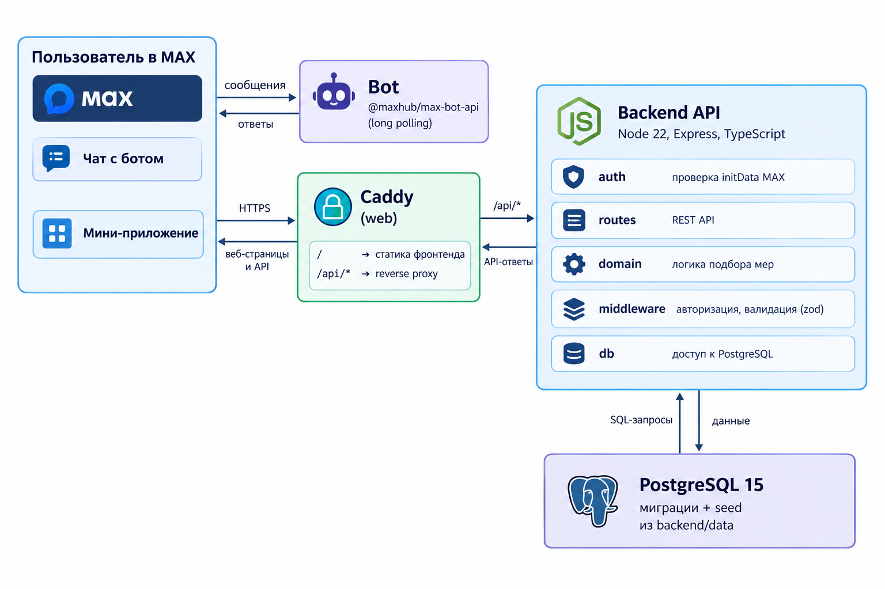

# MSP Helper — бот подбора мер поддержки для МСП

Бот и мини-приложение в мессенджере **MAX** для малого и среднего бизнеса.
Предприниматель отвечает на несколько вопросов о своём бизнесе, а сервис подбирает подходящие меры государственной поддержки и показывает по каждой из них условия, список документов и порядок получения.

Бот: `@t784_hakaton_max_bot`

## Что умеет

- Собирает профиль бизнеса: регион, форма оформления (самозанятый / ИП / ООО), этап (идея / старт / действующий / рост), направление деятельности, число сотрудников, какую поддержку ищет.
- Подбирает меры поддержки под профиль и ранжирует их по релевантности.
- Для каждой меры показывает описание, условия, необходимые документы, ссылку на первоисточник.
- Проверяет подлинность пользователя через `initData` мини-приложения MAX (HMAC-подпись + срок жизни).

## Архитектура



| Компонент | Технологии                               |
| --------- | ---------------------------------------- |
| Backend   | Node.js 22, TypeScript, Express, zod, pg |
| Bot       | `@maxhub/max-bot-api`                    |
| Frontend  | SPA (Vite), раздаётся через Caddy 2      |
| БД        | PostgreSQL 15                            |
| Запуск    | Docker Compose                           |

## Быстрый старт

Требуется Docker и Docker Compose.

```bash
git clone <URL репозитория>
cd <папка проекта>

cp .env.example .env
# заполнить MAX_BOT_TOKEN

docker compose up -d --build
```

После запуска:

| Что                         | Адрес                                                      |
| --------------------------- | ---------------------------------------------------------- |
| Веб / мини-приложение       | http://localhost                                           |
| API                         | http://localhost/api (напрямую: http://127.0.0.1:8000/api) |
| Health-check                | http://localhost/api/health                                |
| PostgreSQL (для разработки) | 127.0.0.1:5433                                             |

Остановка: `docker compose down` (данные сохраняются в volume `pgdata`; полный сброс — `docker compose down -v`).

> Backend-образ копирует сертификаты Минцифры (`russian-trusted-root-ca.cer`, `russian-trusted-sub-ca.cer`) — они лежат в `backend/` и нужны для TLS-соединений с российскими API. Не удаляйте их.

## Переменные окружения

Файл `.env.example` — шаблон без секретов. Реальный `.env` не коммитим.

| Переменная                          | Назначение                                                                               | По умолчанию                   |
| ----------------------------------- | ---------------------------------------------------------------------------------------- | ------------------------------ |
| `DB_USER`, `DB_PASSWORD`, `DB_NAME` | доступ к PostgreSQL                                                                      | postgres / — / max_sme_support |
| `DB_HOST`, `DB_PORT`                | для запуска backend **вне** Docker (в Compose подставляются автоматически)               | localhost / 5433               |
| `MAX_BOT_TOKEN`                     | токен бота MAX                                                                           | —                              |
| `MAX_BOT_USERNAME`                  | username бота                                                                            | t784_hakaton_max_bot           |
| `DOMAIN`                            | домен для Caddy (`:80` — HTTP без TLS; для боевого домена Caddy сам выпустит сертификат) | `:80`                          |
| `INIT_DATA_MAX_AGE_SECONDS`         | максимальный возраст `initData`                                                          | 86400                          |
| `DEV_AUTH_BYPASS`                   | отключает проверку подписи для локальной отладки. **В продакшене всегда `false`**        | false                          |

## Как проверить

Основной сценарий проходит внутри MAX:

1. Пользователь открывает чат-бота.
2. Запускает мини-приложение.
3. Нажимает **«Начать подбор»**.
4. Заполняет анкету:
   - регион;
   - организационно-правовая форма;
   - этап развития бизнеса;
   - направление деятельности;
   - количество сотрудников;
   - вид необходимой поддержки.
5. При необходимости указывает или выбирает код ОКВЭД.
6. Система формирует профиль пользователя.
7. Алгоритм подбора сравнивает профиль с критериями доступных мер поддержки.
8. Пользователь получает список подходящих мер.
9. Может открыть карточку конкретной меры.
10. В карточке отображаются:
    - описание;
    - условия;
    - требования;
    - необходимые документы;
    - информация о порядке получения;
    - ссылка на первоисточник.
11. Пользователь может сохранить интересующие меры в избранное.

Для полноценного сценария мини-приложение необходимо запускать из MAX через подключённого бота. При прямом открытии публичного URL в обычном браузере отсутствует контекст MAX WebApp `initData`.

## Данные

- Каталог мер поддержки и справочники (регионы, формы оформления, этапы, направления) лежат в `backend/data` и загружаются в БД при старте.
- Схема БД создаётся миграциями из `backend/migrations`.
- Данные **демонстрационные**: подготовлены для хакатона на основе открытых источников и не являются официальной выдачей ведомств.

## Структура репозитория

```
backend/
  src/
    auth/
    bot/
    db/
    domain/
    middleware/
    routes/
  data/
  migrations/
  Dockerfile
frontend/
  src/
  public/
  Caddyfile
  Dockerfile
compose.yaml
.env.example
openapi.yaml
DATA-API.yaml
```

## Ограничения

- Каталог мер поддержки демонстрационный и неполный; актуальность условий нужно сверять с первоисточником.
- Подбор основан на правилах соответствия профиля критериям меры; это не юридическая консультация и не гарантия получения поддержки.
- Бот работает только в мессенджере MAX; вне MAX API доступен лишь в режиме `DEV_AUTH_BYPASS`.
- Порты PostgreSQL и backend проброшены только на `127.0.0.1`; наружу открыты 80 и 443 (Caddy).
- Нет отправки заявок в ведомства — сервис только информирует и подбирает.

## Разработка без Docker

```bash
# БД
docker compose up -d postgres_db

# backend
cd backend && npm ci && npm run dev

# frontend
cd frontend && npm ci && npm run dev
```
